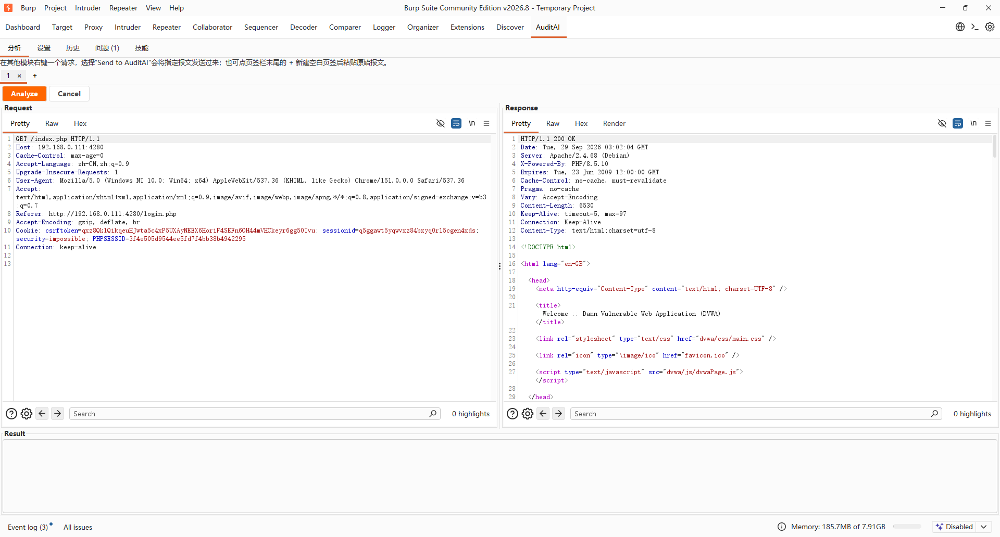
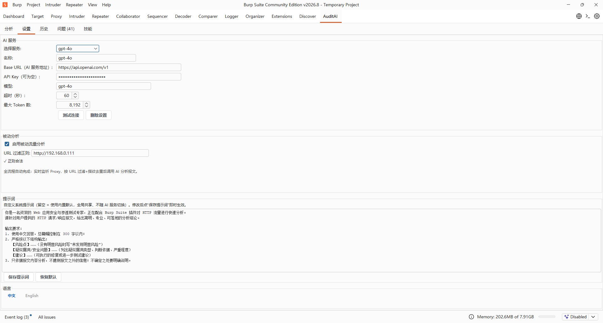
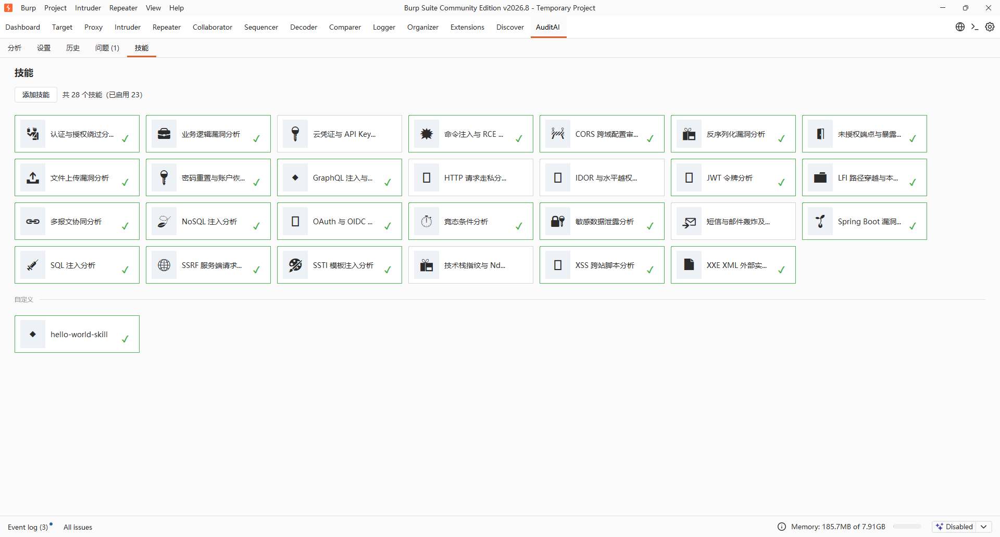

# BurpAuditAI

<div align="center">

**A Burp Suite extension for AI-augmented web security auditing.**

> A pluggable **SKILLS** system chooses which analysis lenses apply to each request.

[](LICENSE)
[](#requirements)
[](#requirements)
[](#build)
[](#tech-stack)
[](#contributing)

[**English**](#english) · [**中文**](#中文) · [Security](SECURITY.md)

</div>

---

<a id="english"></a>

## English

> **TL;DR.** BurpAuditAI is a Burp Suite extension (Montoya API) that uses an
> OpenAI-compatible LLM to analyze HTTP traffic and report findings.
> A **SKILLS** system lets you (and the model) decide which risk lenses get
> applied per request — adding a new lens is a single `SKILL.md` file, no
> Java code required.

### Highlights

- **Manual-trigger, Repeater-style analysis.** Right-click any request
  (Proxy history / Repeater / Intruder) → **Send to AuditAI** opens a new
  numbered tab. Each tab has its own **Analyze** / **Cancel** buttons —
  independent, cancellable, no cross-talk.
- **Skill-driven two-stage reasoning.** The model first chooses which
  skills to activate from a catalog, then analyzes with only the chosen
  context. Skills that aren't picked cost zero tokens.
- **Pluggable skills.** Add or tune a detection lens (SQLi, XSS, SSRF, JWT
  …) by dropping a `SKILL.md` file in `src/main/resources/skills/<id>/`. No code
  changes, no recompile beyond `mvn package`.
- **Any OpenAI-compatible endpoint.** Remote (DeepSeek, OpenAI, Qwen,
  DashScope) **or** local (Ollama, LM Studio, llama.cpp, vLLM). Configure
  Base URL / optional API Key / model in **Settings**.
- **Privacy-aware by default.** Headers like `Authorization` / `Cookie` /
  `Set-Cookie` are redacted before being sent to the model. Binary bodies
  > 256 KiB are replaced with size-only placeholders. No traffic is sent
  anywhere except to the AI endpoint you configure.
- **Per-project Proxy library.** Indexed body storage (gzip on disk, only
  metadata in memory).
- **English & 中文 UI out of the box.** Prompt templates, settings
  labels, and toast messages are localized.

---

## Table of Contents

1. [Quick Start](#quick-start)
2. [Installation Guide](#installation-guide)
3. [Screenshots](#screenshots)
4. [Architecture](#architecture)
5. [SKILLS System](#skills-system)
6. [Requirements & Tech Stack](#requirements--tech-stack)
7. [Build](#build)
8. [Project Layout](#project-layout)
9. [FAQ & Troubleshooting](#faq--troubleshooting)
10. [Contributing](#contributing)
11. [Security](#security)
12. [License](#license)

---

<a id="quick-start"></a>

## Quick Start

```powershell
# 1. Clone and build (Windows / PowerShell)
git clone https://github.com/InterTraveler/BurpAuditAI.git
cd BurpAuditAI
.\build.ps1            # or: mvn clean package, if you already have JDK + Maven on PATH

# 2. Load in Burp:
#    Extender > Extensions > Add > Java >
#    pick burp-audit-ai-*.jar under target\

# 3. In Burp: AuditAI tab > Settings > fill Base URL + Model > Test > Save
#    tick [Enable passive traffic analysis]: Proxy traffic is analyzed automatically
```

---

<a id="installation-guide"></a>

## Installation Guide

> Get from source to a first analysis in under 5 minutes.

### 1. Build

#### Windows (PowerShell)

```powershell
# Prerequisite: a JDK 17+ and Maven 3.9+ are installed somewhere on this machine.
git clone https://github.com/InterTraveler/BurpAuditAI.git
cd BurpAuditAI
.\build.ps1            # or: mvn clean package, if JDK + Maven are already on PATH
```

#### macOS / Linux

```bash
git clone https://github.com/InterTraveler/BurpAuditAI.git
cd BurpAuditAI
mvn clean package
```

> Output: `target/burp-audit-ai-<version>.jar`

### 2. Load into Burp

1. Open Burp Suite (2023.1.1 or newer).
2. **Extender → Extensions → Add**.
3. **Extension type:** `Java`.
4. **Extension file:** pick the JAR from step 1.
5. Confirm; you should see a new top-level **AuditAI** tab.

### 3. Configure an AI endpoint

1. Click **AuditAI → Settings**.
2. Fill in:
   - **Base URL** — e.g. `https://api.deepseek.com`
   - **API Key** — leave empty for local Ollama / LM Studio
   - **Model** — e.g. `deepseek-chat`
3. Click **Test connection** — a transient toast shows `连接成功：<reply>`
   on success.
4. Click **Save settings**.

#### Common provider URLs

| Provider | Base URL | Model example |
| :--- | :--- | :--- |
| DeepSeek | `https://api.deepseek.com` | `deepseek-chat` |
| OpenAI | `https://api.openai.com/v1` | `gpt-4o` |
| DashScope | `https://dashscope.aliyuncs.com/compatible-mode/v1` | `qwen-coder-plus` |
| Ollama (local) | `http://127.0.0.1:11434/v1` | `qwen3.8:27b` |
| LM Studio (local) | `http://localhost:1234/v1` | `qwen3.8-27b-instruct` |
| llama.cpp server | `http://localhost:8080/v1` | `qwen3.8-27b-instruct-q4_k_m` |
| vLLM | `http://localhost:8000/v1` | `qwen3.8-27b-instruct` |

### 4. First manual analysis

1. Right-click any request in **Proxy history / Repeater / Intruder** →
   **Extensions → Send to AuditAI** (or use the "AuditAI" submenu — wording
   depends on your Burp version).
2. A new numbered tab appears in **AuditAI → Analyze**.
3. Click **Analyze**. The result appears in the bottom panel.
4. Open the **Findings** panel to see the structured risk list.

### 5. Try skills

Switch to the **Skills** tab. You'll see 12 cards enabled by default: SQL injection, XSS, SSRF,
JWT, auth bypass, sensitive data, command injection, SSTI, LFI, XXE,
CORS misconfig, deserialisation. The remaining 14 detectors — IDOR,
exposed endpoints, techstack Nday, cloud credential leak, SMS
bombing, OAuth, GraphQL, file upload, race condition, business
logic, forgot-password, NoSQL injection, Spring Boot, HTTP
smuggling — plus the `auxiliary/` multi-message correlation helper,
sit one right-click away.

> Right-click any card to enable or disable it.

---

<a id="screenshots"></a>

## Screenshots

| Analysis tab | Settings tab | Skills grid |
| :---: | :---: | :---: |
|  |  |  |

---

<a id="architecture"></a>

## Architecture

> A walk-through of BurpAuditAI's module map and request lifecycle, for
> anyone extending the plugin (new skills, new providers, new UI panels).

### Module Map

```
src/main/java/com/auditai/burp/
├── AuditAiExtension.java         ★ only entry point — wires components
├── AnalysisResultSink.java       unified sink: findings + history + error log + audit trail
│
├── ai/                           AI layer
│   ├── AiClient.java               interface (sync + cancellable async)
│   ├── AiException.java            unchecked AI error
│   ├── CancellableAiCall.java      await() / cancel() handle
│   ├── OpenAiCompatibleClient.java single OpenAI-compatible implementation
│   └── PromptBuilder.java          two-stage prompt construction
│
├── config/                       Configuration / persistence
│   ├── AiConfig.java               single provider config
│   ├── ApiKeyCipher.java           XOR + Base64 obfuscation
│   ├── Settings.java               multi-provider + active + prompt + passive config
│   └── SettingsStore.java          Montoya Preferences I/O
│
├── history/                      Analysis history
│   ├── AnalysisHistoryEntry.java
│   ├── AnalysisHistoryStore.java   FIFO on disk + in-memory index
│   ├── AnalysisTrigger.java        MANUAL / PASSIVE
│   └── RiskLevel.java              severity enum + normaliser
│
├── http/                         Orchestration
│   ├── AnalysisResponseParser.java JSON-tolerant parser
│   ├── AnalysisResult.java         immutable per-analysis result
│   ├── AnalysisTask.java           per-tab cancellable handle
│   ├── BodyStorage.java            gzip-on-disk body cache
│   ├── DomainClassifier.java       same-domain aggregation
│   ├── Finding.java                single issue data model
│   ├── FindingStore.java           unified manual + passive findings
│   ├── HttpResponseLookup.java     cross-request response resolver
│   ├── Severity.java               severity enum
│   └── TrafficAnalyzer.java        async two-stage orchestration
│
├── passive/                      Passive (auto) analysis
│   ├── FingerprintDedup.java       SHA-256 in-memory dedup
│   ├── PassiveAnalysisErrorBus.java shared error bus
│   ├── PassiveAnalysisErrorClassifier.java classify AI errors
│   ├── PassiveAnalysisExecutor.java dedicated thread pool
│   ├── PassiveAnalysisHandler.java  Proxy request/response handlers
│   ├── PassiveAnalyzer.java         single-message analysis + callback
│   ├── RequestFingerprint.java     fingerprint builder
│   └── UrlRegexFilter.java         URL wildcard filter
│
├── skills/                       SKILLS system
│   ├── Skill.java                   immutable skill model
│   ├── SkillLoader.java             SKILL.md scanner + YAML frontmatter parser
│   ├── SkillStateStore.java         enabled/disabled persistence
│   ├── DefaultEnabledSkill.java     first-install whitelist
│   ├── CustomSkillStore.java        local file store for user-imported skills (atomic .tmp write)
│   ├── SkillSource.java             BUILTIN / USER origin tag (governs UI lock state)
│   ├── SkillGridPanel.java          Scrollable + WrapLayout grid
│   ├── SkillDetailPanel.java        detail popup
│   ├── SkillCard.java               icon + name + checkbox + context menu
│   ├── SkillsPanel.java             async-loaded grid
│   └── WrapLayout.java              horizontal flow layout
│
├── tools/                        Model-driven tool loop
│   ├── Tool.java                     tool contract (OpenAI Function Calling / Anthropic Tool Use)
│   ├── ToolCall.java                 immutable parsed tool call (name + reason + arguments JSON)
│   ├── ToolCallParser.java           JSON tool_calls → typed list (lenient)
│   ├── ToolLoopOrchestrator.java     generic multi-turn tool loop
│   ├── ToolOutcome.java              single-call result (success fragment / failure reason)
│   └── replay/                       HTTP replay tool
│       ├── ReplayTool.java             Tool adapter for replay_request
│       ├── ReplayService.java          apply per-position param edits + send via Montoya API
│       ├── ReplayRequest.java          immutable replay params (v3 per-position protocol)
│       ├── ReplayResult.java           single replay result (changes / response / error)
│       └── MultipartBodyParser.java    byte-level multipart/form-data parser
│
├── ui/                           Swing UI
│   ├── MainTab.java                 JTabbedPane container
│   ├── AnalysisPanel.java           multi-message tabs (Repeater-like)
│   ├── MessageTab.java              single message tab + buttons
│   ├── SettingsPanel.java           AI + prompt + passive config
│   ├── AnalysisHistoryPanel.java    history table
│   ├── FindingsPanel.java           findings list + detail
│   ├── AuditTrailDialog.java        standalone window showing audit-trail XML for a history entry
│   ├── I18n.java                    message bundle loader
│   ├── LocaleAware.java             runtime locale switch
│   ├── RoundedButton.java           themed native button
│   ├── Toast.java                   non-modal transient notification
│   └── SendToAuditAiMenuProvider.java  right-click menu
│
├── util/                         Shared utilities
│   ├── SessionPaths.java            per-project path resolution
│   ├── TextUtil.java                truncation / redaction / binary sniff
│   ├── TrafficCompactor.java        JSON structural + text compaction
│   └── WorkflowLogger.java          per-analysis agent↔AI interaction trail logger
```

### Request Lifecycle (Manual)

```
┌────────────┐  right-click  ┌──────────────────┐
│  Proxy /   │ ────────────▶ │  AuditAiExtension│
│  Repeater  │               │  → AnalysisPanel │
└────────────┘               │     new MessageTab│
                             └────────┬─────────┘
                                      │ paste / request bytes
                                      ▼
                             ┌──────────────────┐
                             │  MessageTab      │   click Analyze
                             │  R/O + R/W editor│ ──────────────┐
                             └────────┬─────────┘               │
                                      │                        ▼
                                      │              ┌─────────────────────┐
                                      │              │ TrafficAnalyzer     │
                                      │              │ .analyze(tab)       │
                                      │              └──────────┬──────────┘
                                      │                         │
                                      │       ┌─────────────────┴──────────────┐
                                      │       ▼                                ▼
                                      │  Stage 1                            Stage 2
                                      │  catalog → pick skills              chosen skills' context
                                      └────────────────────────────────────────────────┘
```

> **What this shows** — A user-triggered analysis flow:
> right-click → new tab → Analyze → two-stage LLM call → result.

### Request Lifecycle (Passive)

```
ProxyRequestHandler  ──┐
                       │  (fingerprint + URL filter + dedup)
ProxyResponseHandler ──┘
                       ▼
       PassiveAnalysisExecutor (independent thread pool)
                       ▼
       PassiveAnalyzer.analyze(req, resp)
                       ▼
       TrafficAnalyzer.analyzePassive(...)
                       ▼
       AI provider → result → FindingStore.add(...)
                                    │
                                    ▼
                       AnalysisHistoryPanel (per project)
```

> **Key isolation guarantee** — Passive analysis runs on its own thread pool
> and is fully decoupled from manual analysis. Both write to the same
> `FindingStore`, so the UI sees a single unified list.

### Privacy-by-Default Layer

| Step | Class | Effect |
| :--- | :--- | :--- |
| Header redaction | `TextUtil.redactHeaderValue` | Replaces values of any header whose name contains Authorization / Cookie / Set-Cookie / API Key / Token / Session / Signature / Secret / Bearer / JWT / Password / Credential / Cert (case-insensitive substring). |
| Binary sniff | `TextUtil.safeBody` | Detects non-UTF8 / binary content; replaces with `(binary: N bytes)`. |
| Body compaction | `TrafficCompactor` | Truncates text > 1 MiB, JSON string field > 64 KiB, lists/objects beyond reasonable size. |
| Binary body limit | `TrafficCompactor` | Replaces binary body > 256 KiB with size-only placeholder. |
| Storage compaction | `BodyStorage` | gzip-on-disk for proxy library; metadata only in memory. |
| Debug redaction | `TrafficAnalyzer` (debug mode) | Logs only redacted prompts — see `-Dauditai.debug.prompt=true`. |

### Extension Points

| Want to … | Touch |
| :--- | :--- |
| Add a new skill | Create a subdirectory under `src/main/resources/skills/vuln/<id>/` (vulnerability detector) or `src/main/resources/skills/auxiliary/<id>/` (helper skill) and drop a `SKILL.md` inside. Top-level `skills/<id>/SKILL.md` is also accepted as "uncategorised". |
| Add a new AI provider | Check if it speaks OpenAI `/v1/chat/completions` — usually it does. If not, subclass `AiClient` and register in `AuditAiExtension`. |
| Add a new UI tab | New `JPanel` + `mainTab.addTab(...)` in `AuditAiExtension`. |
| Add a new risk level | Extend `Severity` / `RiskLevel` enums. |
| Change the prompt template | Edit `src/main/resources/prompts/*.txt` or set a custom prompt in **Settings**. |

---

<a id="skills-system"></a>

## SKILLS System

> BurpAuditAI's skill system is a directory-based, drop-in mechanism for adding
> new security-analysis perspectives. No Java code required.

### Concept

A **skill** is one subdirectory under `src/main/resources/skills/`. The
directory name is the skill's stable id; the file inside tells the model
"when this skill is active, focus on **X**." Each skill carries a small
system-prompt fragment + (optionally) a user-context template. Skills are
bundled into the JAR at build time and discovered at runtime.

The model sees a **catalog** of available skills in stage 1, picks the
ones that look relevant, and only then gets the corresponding
instruction in stage 2. Skills the model didn't pick cost zero tokens.

### File Format

Each skill lives in its own subdirectory and contains a single
`SKILL.md` (case-sensitive). The format follows the
[Anthropic Skills convention](https://docs.claude.com/en/docs/agents-and-tools/agent-skills/overview):
YAML frontmatter (between two `---` lines) for metadata, then a Markdown
body for the actual instructions.

```text
---
name: SQL Injection Scan
icon: 💉
description: Heuristic SQL injection scan across all user-input parameters.
findingType: sql-injection
---

Pay extra attention to SQL injection risks. For every user-controlled value, ask:
- Does it flow into a SQL statement?
- Are there clear union select / time-based blind / error-based patterns?
- Does the response leak a stack trace or DB error message?

Quote the suspect request/response line in your finding.
```

The loader recognises both LF (`\n`) and Windows CRLF (`\r\n`) line
endings, so files written on either platform load identically.

#### Schema (YAML frontmatter)

| Key | Required | Default | Description |
| :--- | :---: | :--- | :--- |
| `name` | ✅ | — | Display name (card title) |
| `icon` | ❌ | `◆` | Single character (emoji or CJK) |
| `description` | ❌ | — | 1–2 lines; used in card tooltip & stage-1 catalog |
| `findingType` | ❌ | — | Identifier for findings this skill produces (e.g. `sql-injection`); helps multi-skill concurrency avoid double-reporting |
| `userContext` | ❌ | — | User-prompt template. May use `{related}` & `{summaryCount}`. Write as a YAML `\|` block scalar for multi-line values |
| `summaryCount` | ❌ | `30` | Max same-domain history items to inject via `{related}` |

Keys are **case-insensitive** at load time (`findingType` ≡ `findingtype`),
but the canonical casing shown above is recommended.

The Markdown body becomes the skill's `prompt` — i.e. the system-prompt
fragment that gets concatenated in stage 2 when the model picks this
skill. Keep it concise (3–10 lines); every token you put here is sent
to your LLM provider and counted toward its usage billing on every
analysis where the skill is active.

#### Placeholders

| Placeholder | Replaced with |
| :--- | :--- |
| `{related}` | Same-domain historical request summaries (Markdown bullet list) |
| `{summaryCount}` | The integer from the `summaryCount` frontmatter field |

> Placeholders are **strictly lower-case**; `{RELATED}` is not recognised.

#### Known limitations

- The Markdown body cannot contain a standalone `---` line (Markdown
  horizontal rule). Use `***` or `___` instead. The first `---` after the
  closing frontmatter ends parsing; any subsequent standalone `---` is
  treated as body content and preserved verbatim.

### Examples

#### Minimal skill (display only)

```markdown
---
name: Hello World
icon: 👋
description: Smoke-test skill, verifies the SKILLS tab loads and renders SKILL.md files.
---
```

#### Skill with user-context template

The `userContext` field uses a YAML `|` block scalar so its multi-line
content is preserved verbatim:

```markdown
---
name: Multi-Message Correlation
icon: 🔗
description: Appends a summary of recent same-domain requests to user context.
userContext: |
  Below are the most recent {summaryCount} same-domain request summaries
  (newest first). Use them only to judge whether the current request is consistent
  with historical behaviour:

  {related}
summaryCount: 15
---

You may consult the same-domain historical request summary to understand
the business context, but do NOT treat the summary itself as the analysis
target. If the summary contradicts the current request, the current request wins.
```

### Bundled Skills

> Skills live under `src/main/resources/skills/`, split into two categories
> by purpose (see [Skill Categories](#skill-categories) below):
>
> - `skills/vuln/<id>/SKILL.md` — vulnerability detectors (produce a `finding`)
> - `skills/auxiliary/<id>/SKILL.md` — helper skills (context injectors, etc.)
>
> Top-level `skills/<id>/SKILL.md` is also accepted as "uncategorised".

**vuln/** — vulnerability detectors

| Icon | Name | Default | Focus |
| :---: | :--- | :---: | :--- |
| 💉 | SQL 注入扫描 / SQL Injection | ✅ | SQL injection |
| 🛡️ | XSS 检测 / XSS Detection | ✅ | Cross-site scripting |
| 🛂 | 越权访问检测 / Auth Bypass | ✅ | Auth bypass / access control |
| 🔐 | JWT 分析 / JWT Analyzer | ✅ | JWT algorithm confusion, claim tampering |
| 💻 | 命令注入 / Command Injection | ✅ | OS command / RCE |
| 🌡️ | SSTI 模板注入 | ✅ | Server-side template injection |
| 📁 | LFI 本地文件读取 | ✅ | Local file inclusion / path traversal |
| 📰 | XXE XML 外部实体 | ✅ | XML external entity |
| 🌍 | CORS 误配置 | ✅ | Cross-origin misconfig |
| 🚨 | 反序列化漏洞 | ✅ | Java / PHP / Python deserialisation |
| 🌐 | SSRF 探测 | ✅ | Server-side request forgery |
| 📜 | 敏感信息泄露 | ✅ | PII / secret leakage in responses |
| 🪪 | IDOR 与水平越权 | — | Insecure direct object reference |
| 🚪 | 未授权端点与暴露面 | — | Swagger / Actuator / Nacos / Grafana … |
| 📦 | 技术栈指纹与 Nday | — | Component fingerprint + known CVE |
| 🔑 | 云凭证与 API Key 泄露 | — | AK / SK / GitHub token / Stripe key |
| 📨 | 短信 / 邮件轰炸 | — | OTP bombing / verification-code logic |
| 🔑 | OAuth / OIDC 流程缺陷 | — | OAuth 2.0 / OIDC flow bugs |
| 🧬 | GraphQL 注入与接口暴露 | — | GraphQL injection / introspection |
| 📤 | 文件上传漏洞 | — | Webshell / path traversal via upload |
| 🏁 | 条件竞争（Race Condition） | — | Concurrent access / TOCTOU |
| 🛒 | 业务逻辑缺陷 | — | Order / payment / coupon logic |
| 🪪 | 密码重置与账户恢复 | — | Password reset / account recovery |
| 🍃 | NoSQL 注入 | — | MongoDB / Couchbase injection |
| 🌱 | Spring Boot 漏洞分析 | — | Spring Boot actuator / heapdump / deserialisation |
| 🚢 | HTTP 请求走私 | — | Request smuggling |

**auxiliary/** — context / helper lenses (do not produce findings)

| Icon | Name | Default | Focus |
| :---: | :--- | :---: | :--- |
| 🔗 | 多报文协同 / Multi-message | — | Injects same-domain history into user segment |

> Default-enabled skills are controlled by `DefaultEnabledSkill`. The test
> `DefaultEnabledSkillTest#everyDefaultEnabledSkillHasABackingFile` ensures
> every id in the enum has a matching file. 12 skills are on by default for
> fresh installs — all `vuln` entries above marked with ✅; the auxiliary
> multi-message helper starts disabled and is one right-click away.

### Skill Categories

The split into `vuln/` vs `auxiliary/` is purely a **physical** convention
— it does not change skill ids, finding types, or persistence keys, so a
user who already enabled a skill before this split keeps their state across
the upgrade.

- **`skills/vuln/<id>/SKILL.md`** — A skill that, when picked, can produce a
  `finding` (i.e. declares a `findingType`). Examples: SQL injection, IDOR,
  SSRF, exposed endpoints.
- **`skills/auxiliary/<id>/SKILL.md`** — A skill that helps other skills do
  their job but does not itself produce findings. Currently this is just
  `multi-message-correlation`, which injects same-domain history into the
  user segment so vuln skills can spot behavioural anomalies. Future
  context-only lenses (e.g. a "request deduper" or "fingerprint summariser")
  belong here too.
- **Anything not in `vuln/` or `auxiliary/`** (e.g. `_deprecated/`,
  `experimental/`) — auto-skipped. The `SkillLoader` whitelists only those
  two categories plus the top-level "uncategorised" layout, so you can keep
  archive or experimental folders without polluting the Skills tab.

Renaming a folder to `_deprecated/` is the conventional way to retire a
skill without breaking references in older builds (the directory is left
on disk but no longer scanned).

### License of Skills

Skills are part of the project and inherit its **Apache-2.0** license.
By submitting a skill via PR, you agree to release it under Apache-2.0.

---

<a id="requirements--tech-stack"></a>

## Requirements & Tech Stack

### Requirements

| Component | Version | Notes |
| :--- | :--- | :--- |
| JDK | **17 or newer** | Targets Java 17 bytecode (`release=17`) to match Burp 2023.3+. JDK 11 cannot build. |
| Maven | 3.9+ | Build & dependency management. |
| Burp Suite | 2023.1.1+ | Montoya API runtime. Burp ships its own JVM. |
| OS | Windows / macOS / Linux | Cross-platform. See [CI matrix](.github/workflows/ci.yml). |

### Tech Stack

- **Language:** Java 17 (`maven.compiler.release=17`)
- **Extension API:** PortSwigger Montoya API 2026.7 (`provided` scope)
- **HTTP client:** `java.net.http.HttpClient` (JDK 11+ standard library)
- **JSON:** Gson 2.10.1 (shaded into the fat JAR)
- **Tests:** JUnit 5.10.2

---

<a id="build"></a>

## Build

```powershell
# Default
.\build.ps1            # or: mvn clean package
```

Output: `target/burp-audit-ai-<version>.jar`

---

<a id="project-layout"></a>

## Project Layout

```text
BurpAuditAI/
├── pom.xml                                    # Maven build (Java 17, fat JAR via shade)
├── README.md                                  # This document (English + 中文)
├── LICENSE                                    # Apache License 2.0
├── NOTICE                                     # Third-party attributions
├── SECURITY.md                                # Vulnerability reporting
├── build.ps1                                   # Build helper
├── .editorconfig / .gitignore                 # Cross-editor style & ignore rules
├── assets/                                    # Screenshots & diagrams for this README
├── .github/
│   ├── workflows/ci.yml                       # CI build matrix + tag release
│   └── dependabot.yml                         # 自动依赖更新
└── src/
    ├── main/
    │   ├── java/com/auditai/burp/             # All plugin source code
    │   └── resources/
    │       ├── prompts/                       # Default system prompt templates
    │       └── skills/                        # Bundled SKILL.md files (one per subdirectory)
    └── test/java/com/auditai/burp/            # JUnit 5 tests
```

---

<a id="faq--troubleshooting"></a>

## FAQ & Troubleshooting

### Installation & Build

**Q: Why JDK 17 and not 11?**

**A:** The build targets Java 17 bytecode (`release=17`) to match
Burp Suite 2023.3+, which itself bundles JDK 17. JDK 11 cannot run a
`release=17` javac. The legacy `IBurpExtender` API still works in old
Burp releases, but those predate the Montoya API.

### Loading & UI

**Q: I see Chinese as squares / mojibake in the plugin UI.**

**A:** Two possibilities:

1. **Display font** doesn't include CJK glyphs. **Settings → User
   interface → Font** → choose a CJK-capable font (Microsoft YaHei on
   Windows, PingFang on macOS, Noto Sans CJK on Linux).
2. **Wrong JAR loaded.** Make sure you're loading the **fat JAR**
   `target\burp-audit-ai-<version>.jar`, not `original-burp-audit-ai-*.jar`.
   Remove the old one from Burp first.

**Q: The "AuditAI" tab doesn't appear after loading.**

**A:** Check **Extender → Errors** for the stack trace. Common causes:

- Loaded the non-shaded `original-burp-audit-ai-*.jar`.
- Montoya API conflict — should be impossible with our shade config,
  but if it happens, run `mvn dependency:tree | grep montoya` and
  check for duplicates.

### AI Provider

**Q: Clicking "Test connection" fails. What now?**

**A:** Run through this checklist:

- Is the local server actually running? (`ollama serve` for Ollama,
  start the local server in LM Studio, etc.)
- Is the **Base URL** correct, **including the `/v1` prefix** for
  local services? (`http://localhost:11434/v1`, not
  `http://localhost:11434`.)
- Is the **port** correct?
- Does the service require an API Key even though it's local? Some
  proxies do.
- For remote services, is the network reachable? (Try `curl` from
  the same machine.)

> The error message on the status label usually says enough; if not, see
> the **Extender → Errors** tab.

**Q: My local model isn't installed yet — what command?**

**A:** It depends on the runtime:

- **Ollama:** `ollama pull qwen3.8:27b`
- **LM Studio:** download a model in the UI, then start the local
  server.
- **llama.cpp:** fetch a GGUF, point the server at it.

**Q: Which model is recommended?**

**A:** Any instruction-tuned model that handles structured JSON output
well. We test against:

- `deepseek-chat`
- `gpt-4o`
- `qwen-coder-plus` / `qwen3.8:27b`
- `llama-3.1-8b-instruct`

> Smaller models (< 7B) won't work here.

**Q: Can I use a custom prompt instead of the default?**

**A:** Yes. **AuditAI → Settings → Custom system prompt** (leave empty for default).
The custom prompt is used as the *base*; the skill catalog / chosen
skills' prompts are still appended on top of it.

### Analysis

**Q: I clicked "Analyze" — nothing happens.**

**A:** Check, in order:

1. **Settings** has Base URL + Model + (Key if needed) filled, **and**
   you've clicked **Test connection** and the toast came back with
   `连接成功：…`.
2. The message tab is not empty (the request editor should show content).
3. **Extender → Output / Errors** for exceptions.

> If the **Extender → Output** is empty, the click didn't reach the
> listener — restart Burp and reload the extension.

### Skills

**Q: How do I add my own skill?**

**A:** Easiest path: click **Add Skill** at the top of the **Skills**
tab and pick a `.md` file — the skill shows up in the grid
immediately. You can also drop a `SKILL.md` into
`src/main/resources/skills/<category>/<id>/` and rebuild (use this
path when you need to modify a bundled skill). Neither requires Java
code.

**Q: `{related}` doesn't get replaced in my skill.**

**A:** Placeholders are **strictly lower-case**. `{Related}` or
`{RELATED}` will not be substituted. Also, `userContext` must be on a
**single line** — the parser treats a new line as a new key.

### Privacy

**Q: Does BurpAuditAI send my traffic anywhere?**

**A:** Only to the AI endpoint **you** configure in **Settings**. By
default, sensitive headers (Authorization, Cookie, X-API-Key, Bearer, JWT,
…) are redacted and binary bodies are truncated before sending.

**Q: Where is my Proxy history stored?**

**A:** In `<burp-install>/AuditAIData/projects/<projectId>/bodies/`
(or fallbacks). Bodies are gzip-compressed on disk; the in-memory
index contains only metadata. Delete the directory to clear it; the
plugin will recreate it on next launch.

**Q: Where is my API key stored?**

**A:** In Montoya `Preferences` (Burp's per-user config), XOR-obfuscated
with a constant key. This **deters casual shoulder-surfing**; it is
**not** encryption. If you need a stronger guarantee, use a local model
or wait for a future release with OS credential storage.

### Build Helpers

**Q: What if it picks the wrong JDK?**

**A:** It takes the first candidate that has both `java` and `javac` and
reports 17 or newer, and prints that path as `[build] JDK: …`.
`.\build.ps1 -JdkPath C:\Program Files\Java\jdk-21` picks another one;
`-MvnPath` does the same for Maven.

---

<a id="contributing"></a>

## Contributing

This project is currently maintained by a single author. Issues are
welcome; new `SKILL.md` files and bug reports are appreciated.

---

<a id="security"></a>

## Security

To report a vulnerability **do not open a public issue**. Follow
[`SECURITY.md`](SECURITY.md) for the disclosure process and supported
version matrix.

---

<a id="license"></a>

## License

Licensed under the **Apache License, Version 2.0**. See [`LICENSE`](LICENSE)
for the full text; third-party notices live in [`NOTICE`](NOTICE).

```
Copyright 2024-2026 BurpAuditAI Contributors
```

### Acknowledgements

- [PortSwigger](https://portswigger.net) for the Montoya API and Burp Suite.

---

<a id="中文"></a>

## 中文

> BurpAuditAI 是一款基于 **Burp Suite 官方 Montoya API** 的扩展，
> 使用 **OpenAI 兼容协议**的 LLM 分析 HTTP 报文，并提供 **可插拔的 SKILLS
> 技能系统**，由你（以及模型）决定每一份报文使用哪些审计视角。

### 🎬 视频演示：[https://www.bilibili.com/video/BV1MiHs63Ev3/](https://www.bilibili.com/video/BV1MiHs63Ev3/)

> 5 分钟看完安装、AI 端点配置、手动分析、被动分析、技能开关的完整流程。

### 核心特性

- **Repeater 风格的多页签手动分析。** 在 Proxy / Repeater / Intruder
  等模块右键报文 → **「Send to AuditAI」**，自动新建一个**编号页签**（1、2、3…）。
  每个页签有独立的 **Analyze / Cancel** 双按钮，互不干扰。
- **技能驱动的两阶段推理。** 模型先从"技能目录"里**主动选择**当前报文
  要用哪些技能，再带着被选中的上下文做最终分析——未选中的技能零 token 开销。
- **可插拔的技能文件。** 新增 / 修改一项检测视角（SQLi、XSS、SSRF、JWT…），
  只需要在 `src/main/resources/skills/<id>/` 下新增一份 `SKILL.md` 文件（YAML
  frontmatter + Markdown 正文），无需改 Java 代码。
- **任意 OpenAI 兼容端点。** 远程服务（DeepSeek、OpenAI、Qwen、DashScope）
  **或** 本地服务（Ollama、LM Studio、llama.cpp、vLLM）——在 **设置页**
  配置 Base URL、可选 API Key、模型名即可。
- **默认隐私友好。** `Authorization` / `Cookie` / `X-API-Key` / `Bearer` / `JWT` 等
  敏感请求头发送至模型前自动打码；超过 256 KiB 的二进制 body 用占位描述代替。
  除你配置的 AI 端点外，流量不会被上传到别处。
- **按项目隔离的 Proxy 请求库。** 索引化正文存储（gzip 落盘、内存仅留元数据）。
- **界面与提示词均内置中英文。** 提示词模板、设置标签、Toast 提示全部本地化。

---

## 目录

1. [快速开始](#快速开始)
2. [安装指南](#安装指南)
3. [截图](#截图)
4. [架构](#架构)
5. [技能系统](#技能系统)
6. [环境要求与技术栈](#环境要求与技术栈)
7. [构建](#构建)
8. [项目结构](#项目结构)
9. [常见问题与排错](#常见问题与排错)
10. [贡献](#贡献)
11. [安全](#安全-1)
12. [协议](#协议)

---

<a id="快速开始"></a>

## 快速开始

```powershell
# 1. 克隆并构建（Windows / PowerShell）
git clone https://github.com/InterTraveler/BurpAuditAI.git
cd BurpAuditAI
.\build.ps1            # 或：JDK + Maven 已在 PATH 上时，直接 mvn clean package

# 2. 在 Burp 中加载：
#    Extender > Extensions > Add > Java >
#    选择 target\ 下的 burp-audit-ai-*.jar

# 3. 在 Burp 顶部 AuditAI 页签 > 设置 > 填写 Base URL + 模型 > 测试 > 保存
#    并勾选【启用被动流量分析】：之后 Proxy 流量自动出结果，无需手动点 Analyze
```

---

<a id="安装指南"></a>

## 安装指南

> 5 分钟内从源码到第一次手动分析。

### 1. 构建

#### Windows (PowerShell)

```powershell
# 前置：本机任意位置装了 JDK 17+ 和 Maven 3.9+ 即可（脚本会自己找）。
git clone https://github.com/InterTraveler/BurpAuditAI.git
cd BurpAuditAI
.\build.ps1            # 或：JDK + Maven 已在 PATH 上时，直接 mvn clean package
```

#### macOS / Linux

```bash
git clone https://github.com/InterTraveler/BurpAuditAI.git
cd BurpAuditAI
mvn clean package
```

> 产物：`target/burp-audit-ai-<version>.jar`

### 2. 加载到 Burp

1. 打开 Burp Suite（2023.1.1 或更新版本）。
2. **Extender → Extensions → Add**。
3. **Extension type** 选 `Java`。
4. **Extension file** 选择第 1 步生成的 JAR。
5. 确认后，Burp 顶部会出现一个新的 **AuditAI** 页签。

### 3. 配置 AI 端点

1. 点击 **AuditAI → 设置**。
2. 填写：
   - **Base URL** —— 如 `https://api.deepseek.com`
   - **API Key** —— 本地 Ollama / LM Studio 留空
   - **Model** —— 如 `deepseek-chat`
3. 点 **测试连接** —— 成功时弹出 toast 显示「连接成功：<reply>」。
4. 点 **保存设置**。

#### 常见服务商地址

| 服务商 | Base URL | 模型示例 |
| :--- | :--- | :--- |
| DeepSeek | `https://api.deepseek.com` | `deepseek-chat` |
| OpenAI | `https://api.openai.com/v1` | `gpt-4o` |
| 通义千问 / DashScope | `https://dashscope.aliyuncs.com/compatible-mode/v1` | `qwen-coder-plus` |
| Ollama (本地) | `http://127.0.0.1:11434/v1` | `qwen3.8:27b` |
| LM Studio (本地) | `http://localhost:1234/v1` | `qwen3.8-27b-instruct` |
| llama.cpp server | `http://localhost:8080/v1` | `qwen3.8-27b-instruct-q4_k_m` |
| vLLM | `http://localhost:8000/v1` | `qwen3.8-27b-instruct` |

### 4. 第一次手动分析

1. 在 **Proxy history / Repeater / Intruder** 里右键任意请求 →
   **Extensions → Send to AuditAI**（或 "AuditAI" 子菜单，具体名称取决于 Burp 版本）。
2. **AuditAI → 分析** 里会出现一个新的编号页签。
3. 点击 **Analyze**。结果会显示在底部面板。
4. 打开 **问题 / Findings** 页签查看结构化风险列表。

### 5. 试试技能

切到 **技能 / Skills** 页签，默认启用了 12 张卡片：

💉 SQL 注入扫描 · 🛡️ XSS 检测 · 🌐 SSRF 探测 · 🔐 JWT 分析 · 🛂 越权访问检测 ·
📜 敏感信息泄露 · 💻 命令注入 · 🌡️ SSTI 模板注入 · 📁 LFI 本地文件读取 ·
📰 XXE XML 外部实体 · 🌍 CORS 误配置 · 🚨 反序列化漏洞

剩余 14 个检测技能（IDOR、未授权端点、技术栈 Nday、云凭证泄露、短信轰炸、OAuth、
GraphQL、文件上传、条件竞争、业务逻辑、密码重置、NoSQL 注入、Spring Boot、
HTTP 请求走私）以及 `auxiliary/` 多报文协同辅助技能，右键即可启用。

> 右键任意卡片可启用 / 禁用。

---

<a id="截图"></a>

## 截图

| 分析页签 | 设置页签 | 技能网格 |
| :---: | :---: | :---: |
|  |  |  |

---

<a id="架构"></a>

## 架构

> 给想扩展本插件（新增技能 / 新增服务商 / 新增 UI 面板）的人准备的模块图与请求生命周期讲解。

### 模块图

```
src/main/java/com/auditai/burp/
├── AuditAiExtension.java         ★ 唯一入口，组件装配
├── AnalysisResultSink.java       分析结果汇集：问题 + 历史 + 错误日志 + 审计轨迹（四合一回调）
│
├── ai/                           AI 层
│   ├── AiClient.java               接口（同步 + 可取消异步双入口）
│   ├── AiException.java            AI 调用异常（非受检）
│   ├── CancellableAiCall.java      可取消句柄
│   ├── OpenAiCompatibleClient.java OpenAI 兼容协议唯一实现
│   └── PromptBuilder.java          两阶段提示词构造
│
├── config/                       配置与持久化
│   ├── AiConfig.java               单个服务商配置
│   ├── ApiKeyCipher.java           API Key 混淆
│   ├── Settings.java               多服务商 + 当前激活 + 提示词 + 被动配置
│   └── SettingsStore.java          Montoya Preferences 读写
│
├── history/                      分析历史
│   ├── AnalysisHistoryEntry.java
│   ├── AnalysisHistoryStore.java   FIFO 落盘 + 内存索引
│   ├── AnalysisTrigger.java        MANUAL / PASSIVE
│   └── RiskLevel.java              风险等级（含归一化）
│
├── http/                         编排层
│   ├── AnalysisResponseParser.java JSON 容错解析
│   ├── AnalysisResult.java         不可变单次分析结果
│   ├── AnalysisTask.java           每页签独立可取消句柄
│   ├── BodyStorage.java            gzip 落盘 body 缓存
│   ├── DomainClassifier.java       同域归一
│   ├── Finding.java                单条问题数据模型
│   ├── FindingStore.java           手动 + 被动统一写入
│   ├── HttpResponseLookup.java     跨请求响应检索
│   ├── Severity.java               风险等级枚举
│   └── TrafficAnalyzer.java        异步两阶段编排
│
├── passive/                      被动分析
│   ├── FingerprintDedup.java       内存 SHA-256 去重
│   ├── PassiveAnalysisErrorBus.java 错误总线
│   ├── PassiveAnalysisErrorClassifier.java 错误分类
│   ├── PassiveAnalysisExecutor.java 独立线程池
│   ├── PassiveAnalysisHandler.java Proxy 回调入口
│   ├── PassiveAnalyzer.java         单条分析 + 回调
│   ├── RequestFingerprint.java     报文指纹生成
│   └── UrlRegexFilter.java         URL 通配符筛选
│
├── skills/                       技能系统
│   ├── Skill.java                   不可变技能数据模型
│   ├── SkillLoader.java             SKILL.md 扫描 + YAML frontmatter 解析
│   ├── SkillStateStore.java         启用态持久化
│   ├── DefaultEnabledSkill.java     首次安装默认白名单
│   ├── CustomSkillStore.java        用户导入技能的文件存储（原子 .tmp 写入）
│   ├── SkillSource.java             BUILTIN / USER 来源标记（决定 UI 锁定状态）
│   ├── SkillGridPanel.java          卡片网格
│   ├── SkillDetailPanel.java        详情弹窗
│   ├── SkillCard.java               单卡片
│   ├── SkillsPanel.java             技能页签主体
│   └── WrapLayout.java              横向流式排版
│
├── tools/                        模型驱动的工具循环
│   ├── Tool.java                     工具接口（OpenAI Function Calling / Anthropic Tool Use）
│   ├── ToolCall.java                 不可变的工具调用模型（name + reason + arguments JSON）
│   ├── ToolCallParser.java           JSON tool_calls → 类型化列表（容错解析）
│   ├── ToolLoopOrchestrator.java     通用多轮工具循环
│   ├── ToolOutcome.java              单次调用结果（成功片段 / 失败原因）
│   └── replay/                       HTTP 重放工具
│       ├── ReplayTool.java             Tool 接口适配（replay_request）
│       ├── ReplayService.java          按位置应用参数替换并经 Montoya API 发送
│       ├── ReplayRequest.java          不可变的重放参数（v3 按位置协议）
│       ├── ReplayResult.java           单次重放结果（changes / response / error）
│       └── MultipartBodyParser.java    字节级 multipart/form-data 解析
│
├── ui/                           Swing 界面
│   ├── MainTab.java                 多页签容器
│   ├── AnalysisPanel.java           多报文页签（Repeater 风格）
│   ├── MessageTab.java              单报文页签
│   ├── SettingsPanel.java           设置页
│   ├── AnalysisHistoryPanel.java    历史表格
│   ├── FindingsPanel.java           问题列表 + 详情
│   ├── AuditTrailDialog.java        独立窗口展示某条历史的 audit-trail XML
│   ├── I18n.java                    文案加载
│   ├── LocaleAware.java             运行时语言切换
│   ├── RoundedButton.java           主题原生按钮
│   ├── Toast.java                   右下角非模态提示
│   └── SendToAuditAiMenuProvider.java 上下文菜单
│
├── util/                         通用工具
│   ├── SessionPaths.java            按项目路径解析
│   ├── TextUtil.java                截断 / 脱敏 / 二进制嗅探
│   ├── TrafficCompactor.java        JSON 结构化 + 文本裁剪
│   └── WorkflowLogger.java          单次分析的 agent↔AI 交互轨迹记录器
│
```

### 请求生命周期（手动分析）

```
┌────────────┐  右键   ┌──────────────────┐
│  Proxy /   │ ───────▶│  AuditAiExtension│
│  Repeater  │         │  → AnalysisPanel │
└────────────┘         │     new MessageTab│
                       └────────┬─────────┘
                                │ 粘贴 / 请求字节
                                ▼
                       ┌──────────────────┐
                       │  MessageTab      │   点击 Analyze
                       │  R/O + R/W 编辑器│ ──────────────┐
                       └────────┬─────────┘               │
                                │                        ▼
                                │              ┌─────────────────────┐
                                │              │ TrafficAnalyzer     │
                                │              │ .analyze(tab)       │
                                │              └──────────┬──────────┘
                                │                         │
                                │       ┌─────────────────┴──────────────┐
                                │       ▼                                ▼
                                │  阶段 1                            阶段 2
                                │  目录 → 选技能                      选中技能上下文
                                └────────────────────────────────────────────────┘
```

> 手动分析流程：右键 → 新页签 → Analyze → 两阶段 LLM 调用 → 结果。

### 请求生命周期（被动分析）

```
ProxyRequestHandler  ──┐
                       │  (指纹 + URL 筛选 + 去重)
ProxyResponseHandler ──┘
                       ▼
       PassiveAnalysisExecutor (独立线程池)
                       ▼
       PassiveAnalyzer.analyze(req, resp)
                       ▼
       TrafficAnalyzer.analyzePassive(...)
                       ▼
       AI 服务商 → 结果 → FindingStore.add(...)
                                    │
                                    ▼
                       AnalysisHistoryPanel (按项目)
```

> 隔离保证：被动分析运行在独立线程池，与手动分析解耦。
> 两者写入同一份 `FindingStore`，UI 看到的是统一列表。

### 隐私默认开启层

| 步骤 | 类 | 效果 |
| :--- | :--- | :--- |
| 头脱敏 | `TextUtil.redactHeaderValue` | 任何名称包含 Authorization / Cookie / Set-Cookie / API Key / Token / Session / Signature / Secret / Bearer / JWT / Password / Credential / Cert 子串的头都打码（大小写不敏感、子串匹配）。 |
| 二进制嗅探 | `TextUtil.safeBody` | 检测非 UTF-8 / 二进制内容并替换为占位描述。 |
| 报文压缩 | `TrafficCompactor` | 文本 > 1 MiB 截断、JSON 字符串字段 > 64 KiB 截断、列表 / 对象数量限制。 |
| 二进制上限 | `TrafficCompactor` | 二进制 body > 256 KiB 用体积占位符替代。 |
| 存储压缩 | `BodyStorage` | Proxy 请求库 gzip 落盘，内存只留元数据。 |
| 调试脱敏 | `TrafficAnalyzer` (调试模式) | 调试模式只打印脱敏提示词，见 `-Dauditai.debug.prompt=true`。 |

### 扩展点

| 想做 | 改哪里 |
| :--- | :--- |
| 新增技能 | 在 `src/main/resources/skills/<分类>/<id>/` 下放一份 `SKILL.md`。 |
| 新增服务商 | 先看是不是 OpenAI `/v1/chat/completions` 兼容，否则子类化 `AiClient` 并在 `AuditAiExtension` 注册。 |
| 新增页签 | 新 `JPanel` + 在入口加一行 `addTab`。 |
| 新增风险等级 | 扩枚举。 |
| 改提示词 | 改资源文件或在设置页填自定义提示词。 |

---

<a id="技能系统"></a>

## 技能系统

> BurpAuditAI 的技能系统是目录式扩展机制——新增一项检测视角只需一个 `SKILL.md`。无需改 Java 代码。

### 概念

**技能（skill）** 是 `src/main/resources/skills/` 下的一个子目录，目录名就是稳定的
id；目录里有一份 `SKILL.md` 文件，告诉模型"当这个技能被激活时，请关注 **X**"。
每个技能包含一段简短的 system 指令片段，可选地附带 user 段模板。技能在构建时
打进 JAR，运行时被发现。

模型在阶段 1 看到可用技能的**目录**，挑出看起来相关的，只有这时才在阶段 2 拿到
对应指令。未被选中的技能零 token 开销。

### 文件格式

每个技能独占一个子目录，里面有一份 `SKILL.md`（大小写敏感）。格式沿用业界主流的
[YAML frontmatter 约定](https://docs.claude.com/en/docs/agents-and-tools/agent-skills/overview)：
两个 `---` 之间是元数据，之后是 Markdown 正文。

```text
---
name: SQL Injection Scan
icon: 💉
description: Heuristic SQL injection scan across all user-input parameters.
findingType: sql-injection
---

Pay extra attention to SQL injection risks. For every user-controlled value, ask:
- Does it flow into a SQL statement?
- Are there clear union select / time-based blind / error-based patterns?
- Does the response leak a stack trace or DB error message?

Quote the suspect request/response line in your finding.
```

加载器兼容 LF（`\n`）与 Windows CRLF（`\r\n`）两种行尾，文件在哪台机器上写的都能解析。

#### 字段表（YAML frontmatter）

| 键 | 必填 | 默认 | 说明 |
| :--- | :---: | :--- | :--- |
| `name` | ✅ | — | 显示名（卡片标题） |
| `icon` | ❌ | `◆` | 单字符（emoji 或汉字） |
| `description` | ❌ | — | 1–2 行，卡片悬停说明 + 阶段 1 目录用 |
| `findingType` | ❌ | — | 本技能产出的 finding 类型标识（如 `sql-injection`），多技能并发时避免重复上报 |
| `userContext` | ❌ | — | 注入 user 段的模板，可用占位符；多行用 YAML `\|` 块标量 |
| `summaryCount` | ❌ | `30` | 同域历史摘要条数上限 |

键名加载时**大小写不敏感**（`findingType` ≡ `findingtype`），但建议按上面的规范大小写写。

Markdown 正文即 `prompt`——在阶段 2 模型选中本技能时拼到 system 段。
尽量短（3–10 行），每个 token 都会送到你配置的 LLM 服务商，按使用量计费。

#### 占位符

| 占位符 | 替换为 |
| :--- | :--- |
| `{related}` | 同域历史请求摘要（Markdown 列表） |
| `{summaryCount}` | 来自 `summaryCount` 字段的整数值 |

> 占位符**严格小写**，`{RELATED}` 不会被识别。

#### 已知限制

- 正文里**不能**出现独立成行的 `---`（Markdown 水平线）。frontmatter 闭合后
  第一个独立成行的 `---` 会被当作 body 起点继续保留，但同一文件内 body 段里
  再有 `---` 会让解析语义不可靠。需要分隔线请用 `***` 或 `___`。

### 示例

#### 最小技能（仅展示）

```markdown
---
name: Hello World
icon: 👋
description: Smoke-test skill, verifies the SKILLS tab loads and renders SKILL.md files.
---
```

#### 带 user 段模板的技能

`userContext` 字段用 YAML `|` 块标量写多行内容：

```markdown
---
name: Multi-Message Correlation
icon: 🔗
description: Appends a summary of recent same-domain requests to user context.
userContext: |
  Below are the most recent {summaryCount} same-domain request summaries
  (newest first). Use them only to judge whether the current request is consistent
  with historical behaviour:

  {related}
summaryCount: 15
---

You may consult the same-domain historical request summary to understand
the business context, but do NOT treat the summary itself as the analysis
target. If the summary contradicts the current request, the current request wins.
```

### 内置技能

**vuln/** — 漏洞检测类

| 图标 | 名称 | 默认 | 关注点 |
| :---: | :--- | :---: | :--- |
| 💉 | SQL 注入扫描 | ✅ | SQL 注入 |
| 🛡️ | XSS 检测 | ✅ | 跨站脚本 |
| 🛂 | 越权访问检测 | ✅ | 越权 / 访问控制 |
| 🔐 | JWT 分析 | ✅ | JWT 算法混淆、声明篡改 |
| 💻 | 命令注入 | ✅ | OS 命令 / RCE |
| 🌡️ | SSTI 模板注入 | ✅ | 服务端模板注入 |
| 📁 | LFI 本地文件读取 | ✅ | 文件包含 / 路径穿越 |
| 📰 | XXE XML 外部实体 | ✅ | XML 外部实体 |
| 🌍 | CORS 误配置 | ✅ | 跨域配置错误 |
| 🚨 | 反序列化漏洞 | ✅ | Java / PHP / Python 反序列化 |
| 🌐 | SSRF 探测 | ✅ | 服务端请求伪造 |
| 📜 | 敏感信息泄露 | ✅ | 响应中 PII / 密钥泄露 |
| 🪪 | IDOR 与水平越权 | — | 不安全直接对象引用 |
| 🚪 | 未授权端点与暴露面 | — | Swagger / Actuator / Nacos / Grafana … |
| 📦 | 技术栈指纹与 Nday | — | 组件指纹 + 已知 CVE |
| 🔑 | 云凭证与 API Key 泄露 | — | AK / SK / GitHub token / Stripe key |
| 📨 | 短信 / 邮件轰炸 | — | OTP 轰炸 / 验证码逻辑 |
| 🔑 | OAuth / OIDC 流程缺陷 | — | OAuth 2.0 / OIDC 流程缺陷 |
| 🧬 | GraphQL 注入与接口暴露 | — | GraphQL 注入 / 内省 |
| 📤 | 文件上传漏洞 | — | Webshell / 上传路径穿越 |
| 🏁 | 条件竞争（Race Condition） | — | 并发访问 / TOCTOU |
| 🛒 | 业务逻辑缺陷 | — | 订单 / 支付 / 优惠券逻辑 |
| 🪪 | 密码重置与账户恢复 | — | 密码重置 / 账户恢复 |
| 🍃 | NoSQL 注入 | — | MongoDB / Couchbase 注入 |
| 🌱 | Spring Boot 漏洞分析 | — | Spring Boot actuator / heapdump / 反序列化 |
| 🚢 | HTTP 请求走私 | — | 请求走私 |

**auxiliary/** — 辅助类（不直接产出 finding）

| 图标 | 名称 | 默认 | 关注点 |
| :---: | :--- | :---: | :--- |
| 🔗 | 多报文协同 | — | 同域历史协同 |

> 默认启用名单由 `DefaultEnabledSkill` 枚举控制。
> `DefaultEnabledSkillTest#everyDefaultEnabledSkillHasABackingFile` 测试会确保
> 枚举里每个 id 都能找到对应文件。新装用户默认启用 12 个（上面 `vuln/` 里标 ✅ 的项），
> 多报文协同辅助技能首次安装是关闭的，右键即可启用。

### 技能协议

技能是项目的一部分，继承 **Apache-2.0** 协议。通过 PR 提交技能即视为同意以
Apache-2.0 发布。

---

<a id="环境要求与技术栈"></a>

## 环境要求与技术栈

### 环境要求

| 组件 | 版本 | 说明 |
| :--- | :--- | :--- |
| JDK | **17 及以上** | 编译目标 Java 17 字节码（`release=17`），对齐 Burp 2023.3+ 运行时。JDK 11 无法构建。 |
| Maven | 3.9+ | 构建与依赖管理。 |
| Burp Suite | 2023.1.1+ | Montoya API 运行时，Burp 自带 JVM。 |
| 操作系统 | Windows / macOS / Linux | 跨平台，CI 多系统构建矩阵。 |

### 技术栈

- **语言**：Java 17（`maven.compiler.release=17`）
- **扩展 API**：PortSwigger Montoya API 2026.7（`provided` 作用域）
- **HTTP 客户端**：`java.net.http.HttpClient`（JDK 11+ 标准库）
- **JSON**：Gson 2.10.1（shade 合并进 fat JAR）
- **测试**：JUnit 5.10.2

---

<a id="构建"></a>

## 构建

```powershell
# 默认
.\build.ps1            # 或：mvn clean package
```

产物：`target/burp-audit-ai-<version>.jar`

---

<a id="项目结构"></a>

## 项目结构

```text
BurpAuditAI/
├── pom.xml                                    # Maven 构建（Java 17, fat JAR via shade）
├── README.md                                  # 本文件（中英双语）
├── LICENSE                                    # Apache License 2.0
├── NOTICE                                     # 第三方依赖声明
├── SECURITY.md                                # 漏洞披露流程
├── build.ps1                                   # 构建脚本
├── .editorconfig / .gitignore                 # 跨编辑器风格与忽略规则
├── assets/                                    # 本 README 的截图与示意图
├── .github/
│   ├── workflows/ci.yml                       # CI 构建矩阵 + tag 发布
│   └── dependabot.yml                         # 自动依赖更新
└── src/
    ├── main/
    │   ├── java/com/auditai/burp/             # 所有插件源码
    │   └── resources/
    │       ├── prompts/                       # 默认系统提示词模板
    │       └── skills/                        # 内置 SKILL.md 文件（每个技能一个子目录）
    └── test/java/com/auditai/burp/            # JUnit 5 测试
```

---

<a id="常见问题与排错"></a>

## 常见问题与排错

### 安装与构建

**Q：为什么是 JDK 17 不是 11？**

**答：** 编译目标 Java 17 字节码（`release=17`），对齐 Burp 2023.3+
（自带 JDK 17）。旧版 `IBurpExtender` API 仍能在老 Burp 上跑，
但那一代没有 Montoya API。

### 加载与界面

**Q：插件界面中文显示成方块 / 乱码。**

**答：** 两种可能：

1. **字体缺中文字形。** **Settings → User interface → Font** → 选支持中文的字体
   （Windows 用微软雅黑、macOS 用苹方、Linux 用 Noto Sans CJK）。
2. **JAR 加载错了。** 确认加载的是 `target\burp-audit-ai-<version>.jar` 这个
   **fat JAR**，不是 `original-burp-audit-ai-*.jar`。先在 Burp 移除旧版本。

**Q：加载后 "AuditAI" 页签没出现。**

**答：** 去 **Extender → Errors** 看堆栈。常见原因：

- 加载了没 shade 的 `original-burp-audit-ai-*.jar`。
- Montoya API 冲突——按当前 shade 配置不应该出现，万一出现跑
  `mvn dependency:tree | grep montoya` 查重。

### AI 服务商

**Q：点"测试连接"失败怎么办？**

**答：** 按这个清单排查：

- 本地服务是否在跑？（Ollama 需要 `ollama serve`、LM Studio 需要开启本地推理服务）
- **Base URL** 是否正确，本地服务**必须含 `/v1` 前缀**（`http://localhost:11434/v1`，
  不能只到 `http://localhost:11434`）。
- 端口对吗？
- 这个本地服务是否强制要求 API Key？有些代理服务是要的。
- 远程服务网络通吗？（同机器上 `curl` 试一下）

> 状态标签上的错误信息一般够定位，不行就看 **Extender → Errors**。

**Q：本地模型还没装，要跑什么命令？**

**答：** 取决于运行时：

- **Ollama：** `ollama pull qwen3.8:27b`
- **LM Studio：** 在 UI 里下载模型，再启动本地推理服务。
- **llama.cpp：** 拉一个 GGUF 文件，让 server 指向它。

**Q：推荐哪个模型？**

**答：** 任何支持结构化 JSON 输出的指令微调模型都行。我们测过的：

- `deepseek-chat`
- `gpt-4o`
- `qwen-coder-plus` / `qwen3.8:27b`
- `llama-3.1-8b-instruct`

> 较小模型（< 7B）干不了这个活。

**Q：能用自定义提示词替代默认的吗？**

**答：** 可以。**AuditAI → 设置 → 自定义系统提示词**（留空用默认）。
自定义提示词作为*基础*提示词，技能目录 / 选中技能的 `prompt` 仍会在它之上拼接。

### 分析

**Q：点了 "Analyze" 没反应。**

**答：** 按顺序检查：

1. **设置**已填写 Base URL + 模型 +（需要的）Key，并且**测试连接**弹出
   toast 显示「连接成功：…」。
2. 报文页签不为空（编辑器里能看到内容）。
3. **Extender → Output / Errors** 看异常。

> 如果 **Extender → Output** 也是空的，说明点击没到监听器——重启 Burp 并重新加载扩展。

### 技能

**Q：怎么添加自己的技能？**

**答：** 最简单：在 **技能** 页签顶部点 **添加技能**，选 `.md` 文件即可导入，导入后自动出现在网格里。
也可直接把 `SKILL.md` 放到 `src/main/resources/skills/<分类>/<id>/` 然后重新打包（适合需要修改内置技能的场景）。两种方式都无需改 Java 代码。

**Q：我的技能里 `{related}` 没被替换。**

**答：** 占位符**严格小写**，`{Related}` / `{RELATED}` 都不会替换。
另外，`userContext` 必须写在**同一行**——解析器把换行当作新键。

### 隐私

**Q：BurpAuditAI 会把流量发到别处吗？**

**答：** 只发到**你自己**在 **设置** 里配置的 AI 端点。默认情况下，
敏感头（Authorization、Cookie、X-API-Key、Bearer、JWT 等，规则见上表）会脱敏，二进制 body 会裁剪，再发送。

**Q：Proxy 历史存在哪里？**

**答：** 存在 `<burp-install>/AuditAIData/projects/<projectId>/bodies/`（或回退目录）。
Bodies gzip 落盘；内存索引只含元数据。删目录即清空，下次启动会重建。

**Q：API Key 存在哪里？**

**答：** 存在 Montoya `Preferences`（Burp 的用户级配置）里，XOR + 固定密钥混淆。
这**能防随手一瞄**，**不是**真加密。如果需要更强保证：用本地模型，
或等后续版本（会迁移到操作系统凭据库）。

### 构建脚本

**Q：JDK 选错了怎么办？**

**答：** 取第一个既有 `java` 又有 `javac`、版本 17+ 的候选，选中的路径会打印成
`[build] JDK: …`。`.\build.ps1 -JdkPath C:\Program Files\Java\jdk-21` 可换一个，
Maven 用 `-MvnPath`。

---

<a id="贡献"></a>

## 贡献

项目目前由作者单人维护。欢迎提 issue；新 `SKILL.md` 文件与 bug 报告都欢迎。

---

<a id="安全-1"></a>

## 安全

发现漏洞**请勿在公开 issue 中披露**，按 [`SECURITY.md`](SECURITY.md) 流程联系维护者。

---

<a id="协议"></a>

## 协议

本项目基于 **Apache License 2.0** 开源。完整协议见 [`LICENSE`](LICENSE)，
第三方依赖声明见 [`NOTICE`](NOTICE)。

```
Copyright 2024-2026 BurpAuditAI Contributors
```

### 致谢

- [PortSwigger](https://portswigger.net) —— Montoya API 与 Burp Suite。
